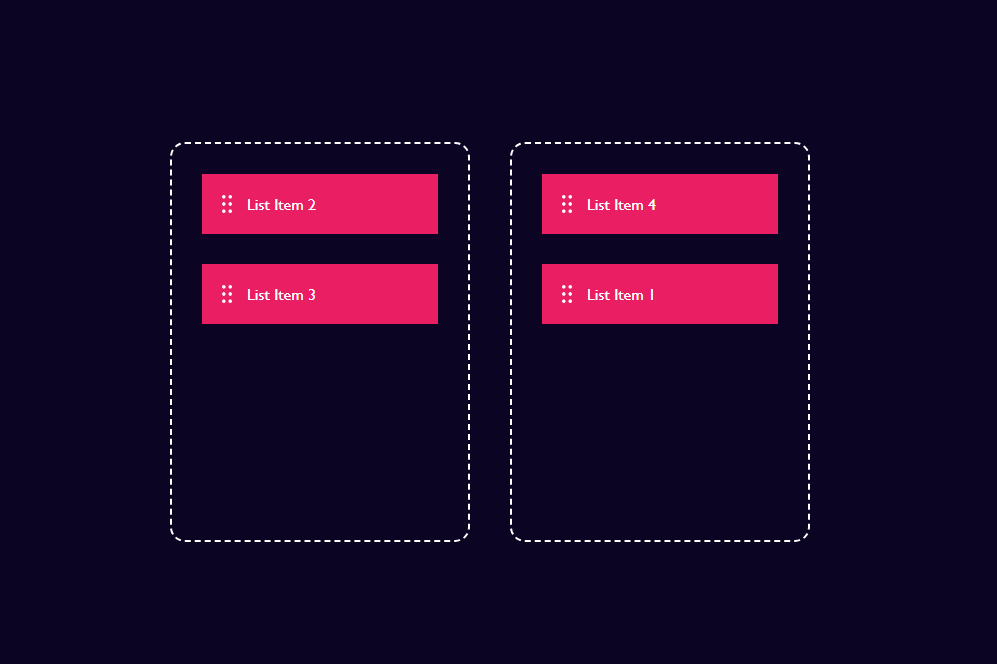

# Drag & Drop Using JavaScript

## Screenshot

---

This project is a simple web app that demonstrates how to implement drag-and-drop functionality using vanilla JavaScript. You can move list items between two boxes by dragging and dropping.

## Features

- Drag items from the left box to the right box and back
- No external libraries required
- Clean and minimal UI

## Files

- `index.html` – Main HTML structure
- `style.css` – App styling
- `script.js` – Drag-and-drop logic
- `drag_drop_icon.png` – Icon for list items

## How to Use

1. Clone or download this repository.
2. Open `index.html` in your web browser.
3. Drag any list item from the left box to the right box, or vice versa.

## Customization

- Add or remove list items by editing the HTML.
- Change the look and feel by modifying `style.css`.

Made with ❤️ using JavaScript 
